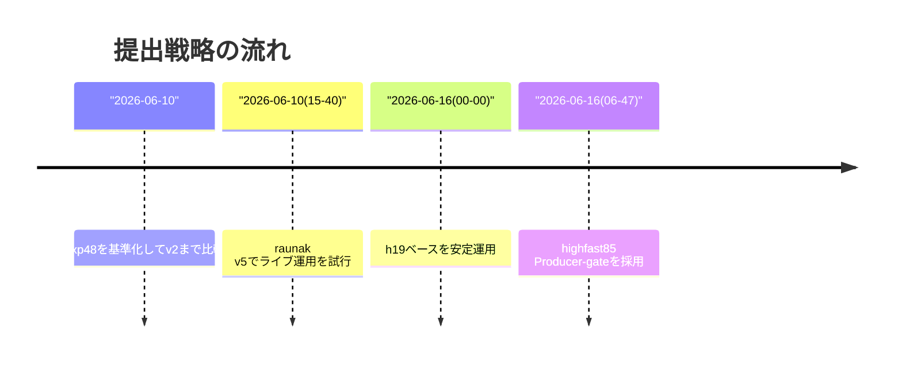
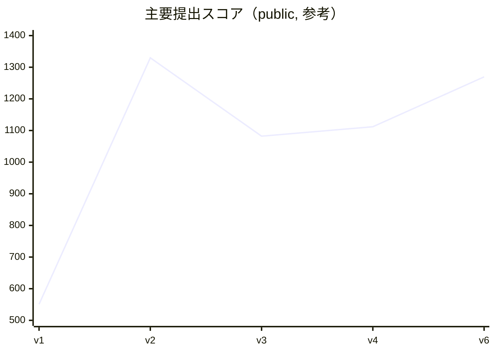

# Orbit Wars 提出ログ

このファイルは提出履歴の正本です。提出前の意図、提出後のKaggle ref、スコア推移、判断理由をここに残します。

## 現在の最終サマリ（2026-06-16 21:16 JST）

- 現在採用/監視対象: `highfast85_producer_gate_20260616.tar.gz`
- 最新提出 ref: `53734299`
- スコア: `1269.5`（`109/4593`, top2=1296.2, top3=1252.8, top5=1224.3）
- 状態の根拠: スナップショット `logs/snapshot_20260616_211633/status.md`
- 最重要運用判断:
  - 4Pは top2維持重視で Producer4P 構成を外さない
  - 新規候補は「2PのProducer対応」と「収束確認」を同時に満たしてから提出
- 参照用: 全履歴はこのファイル下部の時系列ログ（テーブル・生ログ）を参照

## 提出サマリ（短い版）

### 一覧（先に見るべき指標だけ）

| # | 時刻 (JST) | ref | ステータス | スコア | 採否 | 目的 |
|---|---|---:|---|---:|---|---|
| v6 | 2026-06-16 06:47 | 53734299 | `complete` | 1269.5 | `現行採用候補` | 2Pは `best_fast>=85` 時 Producerモードへ。4Pは保守的Producer4P。 |
| v2 | 2026-06-10 14:35 | 53538877 | `complete` | 1329.7 | `再現ベース` | 当時の高スコア基準（公開最高帯）。現在は最新行上書きにより可視性が下がるため、再現の参照点として保持。 |
| v5 | 2026-06-10 15:40 | 53540644 | `pending` | 600〜 | `一時実験` | 先行実験としての投下。ライブ収束条件が未確認。 |
| v4 | 2026-06-10 14:57 | 53539519 | `complete` | 1111.9 | `退場` | kuni系ベース。現行方針の安定性比較用。 |
| v3 | 2026-06-10 14:47 | 53539201 | `complete` | 1082.2 | `退場` | carbon系ベース。現行対策性能では不足。 |
| v1 | 2026-06-10 14:18 | 53538437 | `complete` | 550.9 | `退場` | 1st版。現行基準より大幅劣後。 |

### 7日マップ（ざっくり）

- 目標: 2PのProducer対策を追加し、4P top2維持を守る
- 現在状態: 4P top2維持 + Producer対策として2P限定ゲートを採用（`best_fast>=85`）
- 決定ルール: 「収束確認・pendingなし・latest2維持」を満たさない提出は実行しない
- 再現の最短順: `SUBMISSION_LOG.md`（この表）→ `snapshot` → `logs/local_eval_...json`

読み方:

- `Version`: 作業上の提出番号。古いほど小さい。
- `Kaggle date`（Kaggle日時）: Kaggle API が返した提出日時。
- `File`: 実際に提出したファイル。
- `Message`: Kaggle提出コメント（後で手法を追える内容）。
- `Public score`: その時点で確認できた公開スコア（時間とともに変動）。
- `Notes`: なぜ提出したか、何を確認したか。

特記事項: 行に `Kaggle` 表記がない限り、ローカル環境日時を採用。

| Version | Kaggle日時 | ファイル | コメント | 状態 | スコア | 補足 |
|---|---:|---|---|---|---:|---|
| v6 | 2026-06-16 06:47:18.547000 | `submissions/highfast85_producer_gate_20260616.tar.gz` | `h19 highfast85 Producer-ゲート` | `COMPLETE` | `1269.5` | 2P は `best_fast>=85` の時に Producer へ切替。4P は既存 h19 Producer4P を維持。`logs/snapshot_20260616_211633/status.md` で最新行維持を確認。 |
| v5 | 2026-06-10 15:40:08.477000 | `submissions/raunak_adaptive_clean.tar.gz` | `raunak adaptive clean live test` | `PENDING` | | ローカル一次テストで v2 と `4-4`。このまま live 提出済み。API ref: `53540644`。 |
| v4 | 2026-06-10 14:57:53.037000 | `submissions/kuni_lb1240_clean.tar.gz` | `kuni producer lb1240 clean 基準` | `COMPLETE` | `1111.9` | `kuni05/lb-1240-5-orbit-wars-producer-agent-submission` の整形版を提出。v2 の live には劣る。API ref: `53539519`。 |
| v3 | 2026-06-10 14:47:12.323000 | `submissions/carbon_top1_fork_output.tar.gz` | `carbon top1 fork output 基準` | `COMPLETE` | `1082.2` | `carbon1024/orbit-wars-v1-基準-fork-of-top1` を整理した公開出力。現時点では v2 より弱い。API ref: `53539201`。 |
| v2 | 2026-06-10 14:35:41.603000 | `submissions/exp48_2p_regroup_4p_original.tar.gz` | `exp48 2p regroup 4p original public 基準` | `COMPLETE` | `1329.7` | 当時の最高スコア。後続のチーム表示上書きで見えなくなったため、最終時間までに同等以上の候補がなければ再提出が必要。API ref: `53538877`。 |
| v1 | 2026-06-10 14:18:28.607000 | `main.py` | `pure python flow-diff heuristic v1` | `COMPLETE` | `550.9` | 公開 Flow-Diff/Producer 由来で実装した最初の純 Python 版。bronze目標帯 (`1180+`) を大きく下回るため、改善版を採用。step-by-step運用強化前の提出。API ref: `53538437`。 |

## 運用ルール

1. 提出前に、何を変えたかとローカル検証の根拠を残す。
2. `py_compile` と可能なローカル評価を通す。
3. latest2、保留中、提出間隔を確認する。
4. 次の提出前に、現在の最新提出のLive/Public scoreが収束したことを確認し、snapshotを残す。原則は直近100分以内に3点以上、45分以上の span、score spread `<=35.0`。未収束、未採点、保留中 がある場合は提出しない。
5. 新規提出は原則 `scripts/cautious_submit_orbit.py` 経由にする。このスクリプトは3時間間隔、latest2 保留中、score収束を提出前にブロックする。
6. 提出後にKaggle ref、スコア、snapshot、次の判断を追記する。

以下は時系列の生ログです。古い行には当時の判断がそのまま残っています。現在のルールは本ドキュメント（この `SUBMISSION_LOG.md`）の最新方針を優先します。

## 06:20以降の実験サマリ（読みやすい版）

### 何を解決しようとしていたか

- 前提: ライブで Producer をまねる公開系が増える前提で、`2P/4P` に分けた安全寄り運用を崩さずに勝率を改善する。
- 不可能だったこと: 「全況で勝てる単一戦略」には到達していない。
- 方針: 既存 h19 を基準に、Producer・oldv2 には有利でも、h19 相手に大きく崩れない条件付き変更だけを採用候補化。

### 結果の芯（ここだけ見ればOK）

1. **map-gate系（06:20-06:44）**  
   初期マップ特徴でのゲート分岐は、Producer対策を維持しつつ h19 の勝率を落としやすい。  
   → 収束後も未提出（`lowfast80...` 系4候補は不採用）

2. **action-based 検出（06:45-07:20）**  
   「相手を Producer として予測して行動が一致したら設定切替える」は、Producerには効くが h19-like に誤反応しやすい。  
   → グローバル切替は未採用

3. **softmod 系（07:21-08:55）**  
   切替ではなく、ターゲットボーナス/回避ペナルティの小さな加点で安定寄せを試す方向。  
   - `attack08_avoid24`, `attack08_avoid36`, `attack08_avoid48` は h19-side 安定改善は見えるが Producer優位化は不十分
   - いずれも単独提出に足る勝率改善は確認できず

4. **パラメータスイッチ・古い系統の selector（08:56-11:55）**  
   loss/feature ゲートや初手規制（recovery/攻守の弱化）・oldv2補助を複数試行。  
   - `lossgate`/`早期節約`/`早期攻勢`はいずれも h19 自体との整合が悪化
   - `multisize` 系は oldv2 対策として有望な組み合わせあり（例: `m05_100`）が、Producer/同型相手で落ちる
   → 現時点では単体 h19より全体的に弱い

5. **integrated multisize + partial/defense probe（11:56-13:08）**  
   `nonmine075` / `margin18_floor20` 等を統合やゲートで絞り込みを再実験。  
   oldv2を拾う候補はあるが、h19-like に対するリスクが大きく Live 不能。

6. **後半（13:46-19:40）**  
   `action-gated nonmine075` / soft avoid-only / 追加再検証を実施。  
   path evaluator (`orbit_path_eval.py` 相当) を追加し、複数ファイル束ねや selector の定量手段を整備。  
   ただし「Producer に勝ちやすいが live で安全な汎用手段」まではまだ到達せず。

### まとめると

- その後の結論は単純で、**提出は基本的に“慎重側の現行 h19”維持**。  
- すべての実験は「未採用」に寄り、**`6/16 06:47` の `highfast85 Producer-gate` を土台として運用**が継続。  
- 今後採用可能候補は、`h19 基準の崩れ <→ Producer/oldv2 の改善` の同時達成が確認できるものだけ。  
- 書式は `SUBMISSION_LOG.md` 生ログ（下部）に全部残してあるため、再現時は「要約→生ログ」の順で読む。

## 06:20以降の実験サマリ（要約版）

この区間は大量の未採用実験が詰まったため、要点だけを残します。

- 方針目的: Producer想定を前提に、2P/4Pを崩さず安全性を維持しつつ勝率改善を探る。
- 結論: 未採用候補は多いが、
  - `Producer` 有効化だけを追う切替は h19-like 対戦で崩れやすい
  - map-gate/初期特徴分岐は再現性が不安定
  - multisize/oldv2対策は有望な局面がある一方で `h19-like`/`oldv2` のトレードオフが大きい
- 結果: `2026-06-16 06:47` の `highfast85 Producer-gate` を基準運用として現状維持。
- 判定ルール: 以降の候補は「h19維持」「Producer改善」「oldv2耐性」を同時に満たすもののみ Live検討。

### 主な通過点
- 06:20-08:55: map-gateとaction-based検出を中心に試行（未採用）
- 09:00-11:55: early攻防・oldv2/multisize probe（未採用）
- 11:56-13:45: selector / multisize統合（未採用）
- 13:46-19:40: action-gatedやpath evaluator追加・再現フロー強化（未採用、検証基盤のみ有効化）

### 詳細参照（全文）
- `SUBMISSION_LOG_AFTER_2026-06-16_0620.md`（元ログの時系列全文を保存）
- `SUBMISSION_LOG_SUMMARY_2026-06-16_0620.md`（この区間の別要約）
